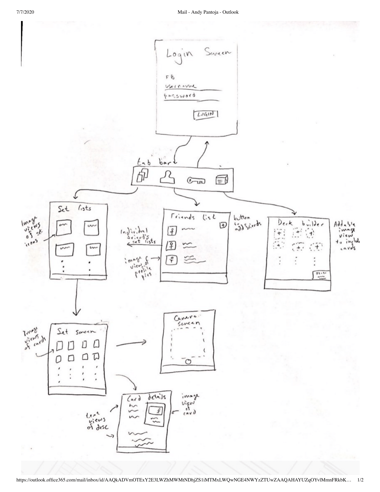

Original App Design Project - README Template
===

# Pokemon Catcher's Catalogue

## Table of Contents
1. [Overview](#Overview)
1. [Product Spec](#Product-Spec)
1. [Wireframes](#Wireframes)
2. [Schema](#Schema)

## Overview
### Description
A platform for pokemon tcg collectors and competitors to keep a record of their cards, create decks, trade, and create wishlists. The Pokemon Trading Card Game (PTCG) releases cards in sets, that is, series of about 100 cards that follow a similar theme. Here we organize our app around these sets.

### App Evaluation
[Evaluation of your app across the following attributes]
- **Category:** Social, Entertainment
- **Mobile:** Very unique to mobile with lots of drag and tap features. Can use the camera. Real time updating and persistence.
- **Story:** Specialized app for a niche group of people. Allow for people to offer trades and view others' collections. My friends would probably understand the appeal even if not in to Pokemon.
- **Market:** The user base will likely be smaller than average but will provide immense value to that niche group. However, the audience is well defined as PTCG collectors and battlers.
- **Habit:** Will likely not create any new habits though will definitely help hobbyists consolidate their own information and save time.
- **Scope:** I think what makes this app good is that the base design is simple enough to implement but there are a motley of features that can be added ad infinitum which suits it well to this program.

## Product Spec

### 1. User Stories (Required and Optional)

**Required Must-have Stories**

* Allow users to have accounts
* Login with username and password
* Logout with username and password
* Use Parse as a backend
* Must use an API to get PTCG data into the app
* Must allow users to have personalized collection
* Organize cards according to which set they belong to
* Must use camera to allow users to take pictures of cards
* Have a card details screen

**Optional Nice-to-have Stories**

* Have a friends list
* Allows friends to trade
* Allows friends to view each others collections
* Use FB login
* Interact with ebay to find current listings
* Implement a twitter feed
* Deck builder mode
* Card battler mode
* Contain information about the latest sets
* Approximate value of certain sets or collections for a user
* Add searches and filters
* ...

### 2. Screen Archetypes

* Login screen
   * Make account
   * Sign in
* Set list screen
   * Shows all the current pokemon sets
   * Allows user to pick which one to go to
* Set collection screen
   * Allows user to view collection for a given set
   * Uploaded with API for TCG data
   * Allow the camera to document individual cards
* Friends list
   * Allows user to view others' collections
   * Allows user to offer trades

### 3. Navigation

**Tab Navigation** (Tab to Screen)

* Set list screen
* Friends list
* Login/Logout
* Deck builder screen as stretch

**Flow Navigation** (Screen to Screen)

* Login
   * Set list screen
   * Future deck builder screen
* Set list screen
   * Set collection screens
* Set collection screen
   * None, but could go to camera screen or ebay screen
* Friends list
   * Friend's set list screen
   * Future chat screen
   * Future deck builder screen

## Wireframes
[Add picture of your hand sketched wireframes in this section]

## Schema 
[This section will be completed in Unit 9]
### Models

Set object
|Property|Type|Description|
|--------|----|-----------|
|name|String|name of the set|
|symbolUrl|String|url of the set symbol image|
|logoUrl|String|url of the set logo image|
|code|String|a unique identifier for the set|
|totalCards|int|the number of cards in this set|

Card object
|Property|Type|Description|
|--------|----|-----------|
|name|String|name of the card|
|id|String|a unique identifier of each card|
|url|String|the url of the card image|
|number|int|the position of the card in the set|

Friend object
|Property|Type|Description|
|--------|----|-----------|
|username|String|username of friend|
|profileUrl|String|url of profile pic|

User Parse object
|Property|Type|Description|
|--------|----|-----------|
|objectId|String|a unique identifier for each user|
|createdAt|Date|time when user was created|
|username|String|name of user|
|password|String|password of user|
|profilePic|String|url of profile pic|

Card Parse object
|Property|Type|Description|
|--------|----|-----------|
|objectId|String|a unique identifier for each card|
|createdAt|Date|time when card was created|
|setName|String|set to which card corresponds to|
|setNumber|int|position of card in set|
|customCardImageUrl|String|url of user taken card image|
|owner|Pointer to User|tells which user owns card|
|count|int|tells how many of this card are owned|

### Networking
- [Add list of network requests by screen ]
- [Create basic snippets for each Parse network request]
- [OPTIONAL: List endpoints if using existing API such as Yelp]
